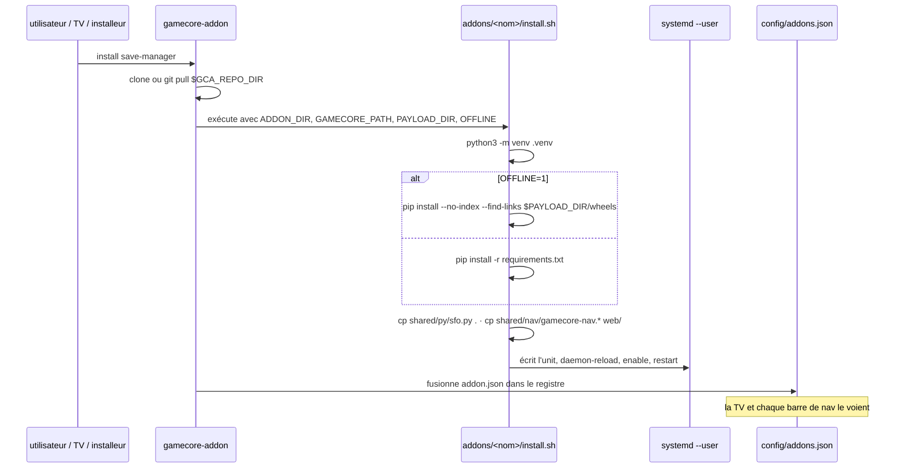

# 2 — Cycle de vie & registre

## Le CLI

`gamecore-addon` est livré avec le dépôt du **cœur**
(`install/gamecore-addon`, installé dans `/usr/local/bin`), pas avec celui-ci.

```
gamecore-addon install <nom>     clone/rafraîchit le dépôt, exécute install.sh, enregistre
gamecore-addon remove  <nom>     exécute uninstall.sh, retire du registre
gamecore-addon update  [nom]     git pull + réexécution d'install.sh (idempotent)
gamecore-addon list  [--json]    contenu du registre
gamecore-addon auth-reset        régénère le mot de passe partagé du cœur
```

Le dépôt est cloné dans `$GCA_REPO_DIR` (`/opt/gamecore-addons` par défaut) et
**les services tournent directement depuis ce clone**. Aucune copie, aucun
build, aucun répertoire intermédiaire : `git log` là-bas dit exactement ce qui
tourne.

## Séquence d'installation



Environnement que le CLI passe à `install.sh` :

| Variable | Signification |
|---|---|
| `ADDON_DIR` | le dossier de cet addon dans le clone |
| `GAMECORE_PATH` | la racine du cœur |
| `PAYLOAD_DIR` | où les ressources hors ligne ont été dépaquetées |
| `OFFLINE` | `1` → installer les wheels depuis `PAYLOAD_DIR/wheels`, sans PyPI |

**`install.sh` doit être idempotent.** `update` le réexécute, et c'est ce qui
rafraîchit les fichiers partagés et l'unit. Tout ce qui ne fonctionne que sur
un boîtier vierge est un bug.

## Le registre — `config/addons.json`

Écrit par le CLI depuis chaque `addon.json`. Il vit dans le dossier `config/`
du **cœur**, exclu du rsync OTA du cœur : le registre survit donc aux mises à
jour.

Deux endpoints le servent :

| Endpoint | Auth | Consommateur |
|---|---|---|
| `GET /api/addons` | LAN : 403 | l'écran Addons de la TV |
| `GET /gc/addons` | aucune | la barre de nav partagée de chaque interface d'addon |

`/gc/addons` existe parce que la barre de nav doit s'afficher *avant* de
connaître l'état de connexion — c'est l'unique charge utile du cœur que Caddy
proxifie sans authentification.

Le `routers/addons.py` du cœur délègue au CLI pour installer/mettre à
jour/supprimer et ne manipule jamais les fichiers d'addons lui-même. C'est ce
qui garde le registre cohérent quelle que soit la façon dont la commande a été
lancée.

## Composants partagés

Chaque addon tourne depuis son propre dossier avec son propre venv et
**n'importe jamais à travers l'arborescence**. Le partage se fait donc par
copie à l'installation :

```bash
echo "[${ADDON_NAME}] Shared components"
cp "${ADDON_DIR}/../../shared/py/sfo.py"            "${ADDON_DIR}/"
cp "${ADDON_DIR}/../../shared/nav/gamecore-nav.js"  "${ADDON_DIR}/web/"
cp "${ADDON_DIR}/../../shared/nav/gamecore-nav.css" "${ADDON_DIR}/web/"
```

| Chemin | Quoi | Consommateurs |
|---|---|---|
| `shared/nav/gamecore-nav.js` + `.css` | la barre de nav inter-addons | tout addon `web` |
| `shared/py/sfo.py` | lecteur PARAM.SFO (titre, série, version, catégorie) | save-manager, rpcs3-manager |

Les copies sont gitignorées (`addons/*/sfo.py`, `addons/*/web/gamecore-nav.*`).

> **`shared/` est la seule version à éditer.** Modifier
> `addons/save-manager/sfo.py` ne change rien en amont et sera écrasé à la
> prochaine mise à jour. Et un addon lancé depuis un clone sans `install.sh` ne
> trouvera pas ces fichiers du tout — l'étape venv n'est pas optionnelle, même
> en développement.

Ajouter un module partagé : le déposer dans `shared/py/`, ajouter la ligne `cp`
aux addons concernés, ajouter la copie au `.gitignore`.

### La barre de navigation

`gamecore-nav.js` (54 l.) interroge `/gc/addons` (même origine) et rend un lien
par addon `web` installé, depuis son `path`. Aucun addon ne connaît le port
d'un autre — c'est ce qui fait que trois services distincts donnent
l'impression d'un seul site, et ce qui permet à Caddy de les déplacer.

## Mise à jour

`gamecore-addon update` = `git pull` + réexécution d'`install.sh` pour chaque
addon installé. Conséquences :

- les fichiers partagés sont rafraîchis ;
- l'unit systemd est réécrite (donc un changement de port dans `install.sh`
  prend effet) ;
- `pip install -r requirements.txt` est relancé ;
- **les modifications locales dans le clone sont perdues** — c'est un arbre de
  travail git, le pull entrera en conflit ou écrasera. Poussez vos changements.

## Désinstallation

`uninstall.sh` arrête et désactive l'unit, puis la supprime. Il ne supprime
délibérément **pas** les données utilisateur : le rôle d'un addon est de gérer
les fichiers du boîtier, pas de les posséder.
