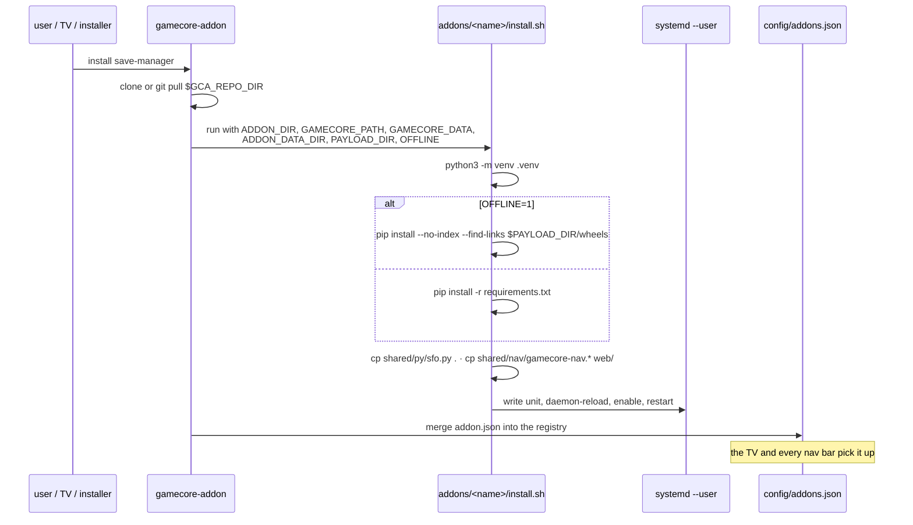

# 2 — Lifecycle & registry

## The CLI

`gamecore-addon` ships with the **core** repo (`install/gamecore-addon`,
installed to `/usr/local/bin`), not with this one.

```
gamecore-addon install <name>    clone/refresh the repo, run install.sh, register
gamecore-addon remove  <name>    run uninstall.sh, drop from the registry
gamecore-addon update  [name]    git pull + re-run install.sh (idempotent)
gamecore-addon list  [--json]    registry contents
gamecore-addon auth-reset        regenerate the core's shared password
```

The repo is cloned to `$GCA_REPO_DIR` (`/opt/gamecore-addons` by default) and
**services run straight from that checkout**. There is no copy, no build, no
staging directory: `git log` there tells you exactly what is running.

## Install sequence



Environment the CLI hands to `install.sh`:

| Variable | Meaning |
|---|---|
| `ADDON_DIR` | this addon's directory in the checkout |
| `GAMECORE_PATH` | the installation — read only, becoming a read-only mount |
| `GAMECORE_DATA` | the player's data — write here (default: `$GAMECORE_PATH`) |
| `ADDON_DATA_DIR` | the addon's own corner, created before the hook runs |
| `GAMECORE_ADDON_API` | the api version the manager speaks (`1`) |
| `PAYLOAD_DIR` | where offline assets were unpacked |
| `OFFLINE` | `1` → install wheels from `PAYLOAD_DIR/wheels`, no PyPI |

**`install.sh` must be idempotent.** `update` re-runs it, which is what
refreshes the shared files and the unit. Anything that only works on a clean
box is a bug.

## The registry — `config/addons.json`

Written by the CLI from each `addon.json`. It lives in the **core's** `config/`
directory, which is excluded from the core's OTA rsync, so the registry
survives updates.

Two endpoints serve it:

| Endpoint | Auth | Consumer |
|---|---|---|
| `GET /api/addons` | LAN: 403 | the TV's Addons screen |
| `GET /gc/addons` | none | the shared nav bar in every addon UI |

`/gc/addons` exists because the nav bar has to render *before* login state is
known — it is the one core payload Caddy proxies without auth.

The core's `routers/addons.py` shells out to the CLI for install/update/remove
and never manipulates addon files itself. That is why the registry stays
consistent whichever way the command was issued.

## Shared components

Each addon runs from its own directory with its own venv and **never imports
across the tree**. Sharing is therefore done by copy at install time:

```bash
echo "[${ADDON_NAME}] Shared components"
cp "${ADDON_DIR}/../../shared/py/sfo.py"            "${ADDON_DIR}/"
cp "${ADDON_DIR}/../../shared/nav/gamecore-nav.js"  "${ADDON_DIR}/web/"
cp "${ADDON_DIR}/../../shared/nav/gamecore-nav.css" "${ADDON_DIR}/web/"
```

| Path | What | Consumers |
|---|---|---|
| `shared/nav/gamecore-nav.js` + `.css` | the cross-addon nav bar | every `web` addon |
| `shared/py/sfo.py` | PARAM.SFO reader (title, serial, version, category) | save-manager, rpcs3-manager |

The copies are gitignored (`addons/*/sfo.py`, `addons/*/web/gamecore-nav.*`).

> **`shared/` is the only version to edit.** Changing
> `addons/save-manager/sfo.py` does nothing upstream and is overwritten on the
> next update. And an addon run straight from a checkout without `install.sh`
> will not find these files at all — the venv step is not optional for
> development either.

Adding a shared module: drop it in `shared/py/`, add the `cp` line to the
addons that want it, add the copy to `.gitignore`.

### The nav bar

`gamecore-nav.js` (54 l.) fetches `/gc/addons` (same origin) and renders a link
per installed `web` addon from its `path`. No addon knows another addon's port
— that is what makes three separate services feel like one site, and what lets
Caddy move them around.

## Updating

`gamecore-addon update` = `git pull` + re-run `install.sh` for each installed
addon. Consequences:

- shared files are refreshed;
- the systemd unit is rewritten (so a port change in `install.sh` takes
  effect);
- `pip install -r requirements.txt` runs again;
- **local edits in the checkout are lost** — it is a git working tree, and the
  pull will conflict or overwrite. Push your changes.

## Uninstall

`uninstall.sh` stops and disables the unit and removes it. It deliberately does
**not** delete user data: an addon's job is to manage the box's files, not to
own them.
