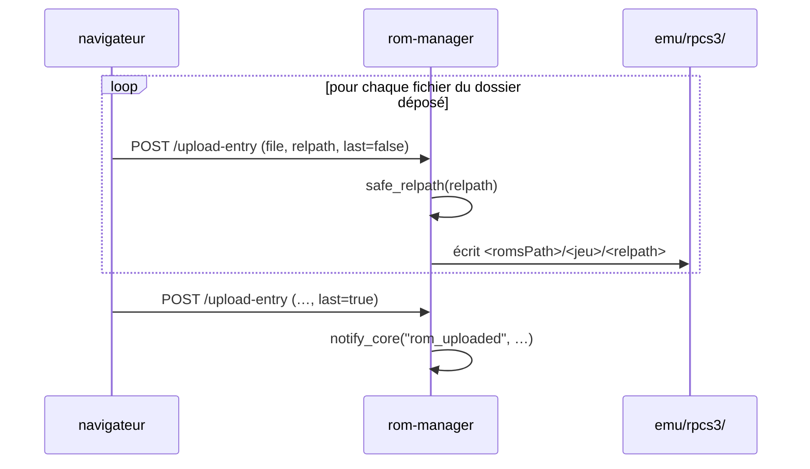

# 3 — rom-manager (:8770, `/roms`)

Envoyer des ROMs depuis n'importe quel navigateur du LAN, et téléverser les
bezels d'overlay. `server.py`, 315 lignes. Le plus simple des trois — à lire en
premier.

## Routes

| Route | Fonction | Notes |
|---|---|---|
| `GET /api/health` | `health()` | test de vie |
| `GET /api/emulators` | `list_emulators()` | systèmes issus du `config/systems.json` du cœur, avec les compteurs |
| `GET /api/roms/{system_id}` | `list_roms(system_id)` | liste pour un système |
| `POST /api/roms/{system_id}/upload` | `upload_rom(system_id, file)` | un fichier |
| `POST /api/roms/{system_id}/upload-entry` | `upload_folder_entry(system_id, file, relpath, last)` | une entrée d'un jeu en dossier |
| `DELETE /api/roms/{system_id}/{filename}` | `delete_rom(system_id, filename)` | fichier ou dossier |
| `POST /api/overlays/{system_id}` | `upload_overlay(system_id, request)` | transmis au cœur |
| `DELETE /api/overlays/{system_id}` | `delete_overlay(system_id)` | |

## Lire la configuration du cœur

L'addon n'a pas sa propre idée de l'emplacement des ROMs. Il lit celle du cœur :

| Fonction | Rôle |
|---|---|
| `systems()` | analyse `$GAMECORE_PATH/config/systems.json` |
| `get_system(system_id)` | une entrée, 404 sinon |
| `roms_path_of(system)` | résout `romsPath` par rapport à `GAMECORE_PATH` |

Un système ajouté sur la TV apparaît donc ici sans modifier l'addon. La
contrepartie est une copie miroir de la logique de balayage :

| Fonction | Reflète |
|---|---|
| `clean_name(filename)` | le `rom_scanner.clean_name` du cœur — retire l'extension et les balises entre crochets |
| `matches_ext(filename, extensions)` | `rom_scanner.matches_ext` |
| `iter_rom_files(roms_path, extensions, scan_dirs)` | `rom_scanner.iter_rom_files` |
| `entry_size(p)` | taille du fichier, ou taille **récursive** d'un dossier de jeu |
| `fmt_size(n)` | format lisible |

> Gardez ces quatre-là synchronisées avec
> `backend/services/rom_scanner.py`. C'est une duplication délibérée (l'addon
> ne doit pas importer le cœur), pas un accident.

## Jeux en dossier

Les jeux PS3 et PS4 sont des arborescences, pas des fichiers — `scanDirs: true`
sur l'entrée du système. Un navigateur ne peut pas envoyer un dossier en un
seul bloc, donc l'interface le parcourt et poste entrée par entrée :



Deux assainisseurs, aux rôles différents :

| Fonction | Rôle |
|---|---|
| `safe_filename(filename)` | retire **uniquement** les caractères réellement dangereux (`/`, NUL) — les noms de jeux contiennent légitimement espaces, crochets, apostrophes et unicode, et les massacrer casse la recherche de jaquette |
| `safe_relpath(relpath)` | assainit un chemin fourni par le client **à l'intérieur** d'un dossier de jeu : rejette l'absolu et `..`, conserve la structure `PS3_GAME/USRDIR/EBOOT.BIN` |

`safe_relpath` est le point critique en sécurité — c'est la seule chose entre
un envoi et une écriture arbitraire. Voir
[6](06-securite-et-pieges.md#le-motif-de-validation-des-chemins).

## Prévenir la TV

```python
CORE_NOTIFY = f"http://127.0.0.1:{CORE_PORT}/api/addons/notify"
```

`notify_core(event, data)` y poste pour que le cœur relaie l'événement sur son
WebSocket et que la TV rafraîchisse sa bibliothèque. C'est **au mieux** — sa
docstring le dit : un cœur injoignable ne doit jamais faire échouer un envoi
déjà arrivé sur le disque.

## Overlays

L'addon relaie l'envoi et la suppression d'overlay au cœur (`CORE_OVERLAYS`)
plutôt que d'écrire lui-même dans `assets/overlays/`, pour que le contrôle des
octets magiques du cœur (`_looks_like_image`) reste l'unique porte d'entrée de
ce qui devient un PNG d'overlay.
