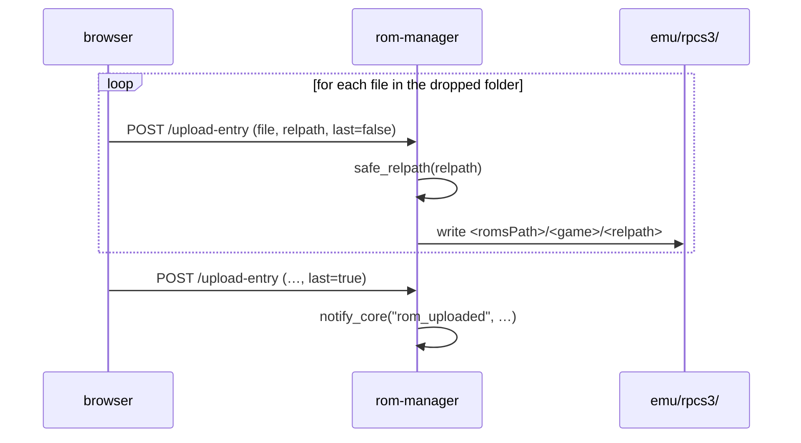

# 3 — rom-manager (:8770, `/roms`)

Upload ROMs from any browser on the LAN, and upload bezel overlays.
`server.py`, 315 lines. The simplest of the three — read it first.

## Routes

| Route | Function | Notes |
|---|---|---|
| `GET /api/health` | `health()` | liveness |
| `GET /api/emulators` | `list_emulators()` | systems from the core's `config/systems.json`, with counts |
| `GET /api/roms/{system_id}` | `list_roms(system_id)` | listing for one system |
| `POST /api/roms/{system_id}/upload` | `upload_rom(system_id, file)` | one file |
| `POST /api/roms/{system_id}/upload-entry` | `upload_folder_entry(system_id, file, relpath, last)` | one entry of a folder-based game |
| `DELETE /api/roms/{system_id}/{filename}` | `delete_rom(system_id, filename)` | file or folder |
| `POST /api/overlays/{system_id}` | `upload_overlay(system_id, request)` | forwarded to the core |
| `DELETE /api/overlays/{system_id}` | `delete_overlay(system_id)` | |

## Reading the core's configuration

The addon does not keep its own idea of where ROMs live. It reads the core's:

| Function | Role |
|---|---|
| `systems()` | parse `$GAMECORE_DATA/config/systems.json` |
| `get_system(system_id)` | one entry, 404 otherwise |
| `roms_path_of(system)` | resolve `romsPath` against `GAMECORE_DATA` — the data root, like the core's `paths.resolve_data_path()` |

So a system added on the TV appears here with no addon change. The trade-off
is a mirrored copy of the scanning logic:

| Function | Mirrors |
|---|---|
| `clean_name(filename)` | the core's `rom_scanner.clean_name` — strips extension and bracketed tags |
| `matches_ext(filename, extensions)` | `rom_scanner.matches_ext` |
| `iter_rom_files(roms_path, extensions, scan_dirs)` | `rom_scanner.iter_rom_files` |
| `entry_size(p)` | file size, or the **recursive** size of a game folder |
| `fmt_size(n)` | human-readable |

> Keep those four in step with `backend/services/rom_scanner.py`. They are a
> deliberate duplication (the addon must not import the core), not an accident.

## Folder-based games

PS3 and PS4 games are directory trees, not files — `scanDirs: true` on the
system entry. A browser cannot upload a directory as one blob, so the UI walks
it and posts entry by entry:



Two sanitizers, doing different jobs:

| Function | Job |
|---|---|
| `safe_filename(filename)` | strips **only** truly dangerous characters (`/`, NUL) — game names legitimately contain spaces, brackets, apostrophes, unicode, and mangling them breaks cover lookup |
| `safe_relpath(relpath)` | sanitizes a client-supplied path **inside** a game folder: rejects absolute and `..`, keeps the structure `PS3_GAME/USRDIR/EBOOT.BIN` |

`safe_relpath` is the security-critical one — it is the only thing standing
between an upload and an arbitrary write. See
[6](06-security-and-traps.md#the-path-validation-pattern).

## Telling the TV

```python
CORE_NOTIFY = f"http://127.0.0.1:{CORE_PORT}/api/addons/notify"
```

`notify_core(event, data)` posts there so the core relays the event on its
WebSocket and the TV refreshes its library. It is **best effort** — its
docstring says so: an unreachable core must never fail an upload that already
landed on disk.

## Overlays

The addon proxies overlay upload/delete to the core (`CORE_OVERLAYS`) rather
than writing `assets/overlays/` itself, so the core's magic-byte check
(`_looks_like_image`) stays the single gate on what becomes an overlay PNG.
