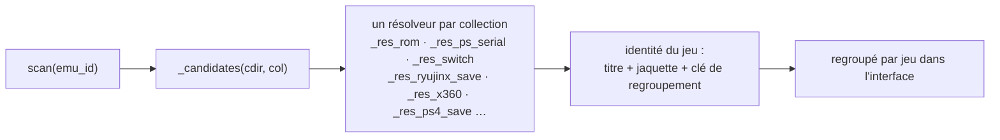

# 5 — save-manager (:8772, `/saves`)

Le plus gros addon : `server.py` 831 l., `catalog.py` 849, `memcard.py` 842,
`guide.py` 191, `ryujinx.py` 98, plus `tools/gamecore-save-export.py` (550) et
deux modules de tests.

Il parcourt, sauvegarde, restaure et supprime les sauvegardes de chaque
émulateur du boîtier — y compris les sauvegardes de jeu individuelles *à
l'intérieur* d'une carte mémoire PlayStation partagée — et importe des
sauvegardes depuis un PC.

## Le problème qu'il résout

Chaque émulateur a inventé sa propre réponse à « où va une sauvegarde, et à
quel jeu appartient-elle ». Certains utilisent le nom de la ROM, d'autres un
numéro de série de disque, d'autres un nom interne de cartouche, d'autres un
identifiant de titre 16 hex, d'autres un compteur local à l'installation, et
deux d'entre eux empaquettent tous les jeux dans un unique fichier binaire.



## Le catalogue

`catalog.py` est la carte. Une entrée par émulateur :

```python
"gopher64": {"label": "Nintendo 64", "bases": [
    HOME / ".var/app/io.github.gopher64.gopher64/data/gopher64",
    HOME / ".local/share/gopher64"], "collections": [
    C("saves",  "files", "save",  [".eep", ".mpk", ".sra", ".fla", ".srm"], "n64"),
    C("states", "files", "state", (), "n64"),
]},
```

`C(subpath, mode, kind, exts, group, glob)` décrit une collection : où elle se
trouve sous la base, si les entrées sont des fichiers ou des dossiers, s'il
s'agit de sauvegardes ou d'états, quelles extensions comptent, et **quel
résolveur** leur donne une identité.

`bases` est une **liste** parce que le même émulateur peut être installé en
Flatpak ou en natif — et les deux dossiers peuvent exister avec un seul
réellement utilisé :

| Fonction | Rôle |
|---|---|
| `resolve_base(emu_id)` | choisit la bonne base quand plusieurs candidates existent |
| `_declared_flatpak(emu_id)` | ce que le `systems.json` du boîtier dit de l'installation |
| `_base_savecount(emu_id, base)` | comptage bon marché des entrées qu'une base produirait — le départage |
| `_load_local_bases()` | fusionne des surcharges propres à la machine depuis un `local_bases.json` optionnel (gitignoré) |

**Ajouter un émulateur = ajouter une entrée de catalogue.** Rien d'autre ne
change.

## Donner un nom à une sauvegarde

L'essentiel de `catalog.py` est la résolution d'identité — transformer un
chemin en « ceci est *Mario Kart DS* » plus une jaquette.

| Résolveur | Émulateur / disposition |
|---|---|
| `_res_rom` | la sauvegarde est à côté de la ROM, même racine de nom |
| `_res_n64` | nom interne de cartouche depuis l'en-tête ROM (`@0x20`) — `_n64_names()` |
| `_res_ps_serial`, `_res_card_or_serial` | numéro de série de disque PS1/PS2 — `disc_serial()`, `_sony_serial()` |
| `_res_gc_card` | le dossier GC de Dolphin mêle des cartes `.raw` brutes et des dossiers GCI |
| `_res_wii`, `_res_dolphin_state` | `_wii_names()`, `_hex_ascii()` (le mot bas de l'identifiant de titre est le code de jeu 4 caractères en hexadécimal) |
| `_res_n3ds`, `_res_n3ds_state` | `_3ds_names()` — identifiant de titre depuis le media id NCSD |
| `_res_wiiu` | `_wiiu_longname(meta_xml)` |
| `_res_switch` | `_switch_names()`, `_switch_dir_names()` — identifiant de titre de base depuis les ids de mise à jour/DLC |
| `_res_ryujinx_save` | identifiant de dossier local à l'installation → identifiant de titre, voir plus bas |
| `_res_rpcs3_save`, `_res_rpcs3_trophy`, `_res_rpcs3_state` | `_savedata_index()` construit série → (TITLE, ICON0) depuis les `PARAM.SFO` ; `_match_savedata_title()` rattache un ensemble de trophées à son jeu |
| `_res_psp_save`, `_res_psp_state` | |
| `_res_x360` | `content/<XUID>/<TitleID>` ; `_x360_header_name()` lit l'en-tête XCONTENT |
| `_res_ps4_save` | `savedata/<CUSA#####>/<savedir>` ; `_ps4_titles()` depuis les dumps de `emu/shadps4` |

Second rôle : `cover_for(*candidates)` associe un jeu à une jaquette GameCore
(les jaquettes portent le nom des racines de ROM), `_clean_stem()` /
`_prettify()` / `_collapse()` transforment un nom de fichier en nom affichable,
`_cached(key, dep, build)` mémorise les constructions d'index coûteuses contre
une dépendance bon marché.

## Identité des sauvegardes Ryujinx — `ryujinx.py`

Ryujinx nomme ses dossiers de sauvegarde avec un **compteur propre à
l'installation** (`0000000000000001`), pas l'identifiant de titre. Le même jeu
vit donc dans un dossier différent sur chaque boîtier, et une sauvegarde ne
peut pas être déplacée d'une machine à l'autre par le seul chemin.

| Fonction | Rôle |
|---|---|
| `save_attr(save_dir)` | `(identifiant de titre 16 hex majuscules, type)` depuis l'ExtraData du dossier |
| `indexer(base)` | nom de dossier → `(identifiant de titre, type)` pour toute l'installation |
| `identify(base, save_dir)` | au mieux, pour un dossier |
| `title_map(base)` | `(identifiant de titre, type) → Path` — ce dont la restauration a besoin |

## Cartes mémoire — `memcard.py`

PS1, PS2 et GameCube empaquettent la sauvegarde de chaque jeu dans **un seul
fichier binaire de carte**. Extraire un jeu impose d'analyser ce format ; le
réimporter impose de reconstruire la FAT et les entrées de répertoire. 842
lignes, trois codecs.

| Format | Lecture | Export | Import | Suppression |
|---|---|---|---|---|
| PS1 | `_ps1_saves`, `_ps1_entry`, `_ps1_chain`, `_ps1_name`, `_ps1_offset` | `_ps1_export` (`.mcs`) | `_ps1_import` | `_ps1_delete` |
| PS2 | `_Ps2` (vue en lecture, `mutable=True` pour les cartes sans ECC), `_ps2_saves`, `_ps2_folder`, `_ps2_title` | `_ps2_export` (`.psu`) | `_ps2_import`, `_parse_psu`, `_mk_entry` | `_ps2_delete` |
| GameCube | `_gc_saves`, `_gc_dir`, `_gc_bat`, `_gc_entries`, `_gc_chain`, `_gc_active` | `_gc_export` (`.gci`) | `_gc_import`, `_gc_write_dir`, `_gc_write_bat` | `_gc_delete` |

Surface publique : `read_saves(path)`, `export_save(card_bytes, key)`,
`import_save(card_bytes, blob, blob_name)`, `delete_save(card_bytes, key)`,
`gci_info(path)` (en-tête d'un `.gci` autonome).

Détails faciles à rater et déjà traités :

- **`_ps1_cksum` / `_gc_csum`** — chaque format a sa propre somme de contrôle,
  et un émulateur rejette (ou corrompt silencieusement) une carte dont la somme
  est périmée.
- **`_gc_active(data, blocks, cs_off, ctr_off)`** — le GameCube conserve deux
  copies du répertoire et de la BAT ; la vivante est « somme de contrôle valide,
  compteur le plus élevé ». Écrire la mauvaise perd des sauvegardes.
- **`_ps1_delete` bascule chaque trame de la chaîne vers son état supprimé**
  plutôt que de la mettre à zéro — c'est ce que fait la console, et ce que les
  émulateurs attendent.
- **`_jis(raw)`** — les titres PS sont en Shift-JIS, souvent en pleine chasse ;
  l'interface a besoin de texte propre.
- **`_is_ps2` / `_is_gc`** — reniflage de format, parce que l'extension ment.

> `tests/test_memcard.py` (271 l.) n'est pas optionnel. Ce code édite une
> structure binaire qui, mal manipulée, détruit la bibliothèque de sauvegardes
> d'un utilisateur sans le moindre message d'erreur.

## Serveur — `server.py`

### Listage

| Route | Fonction | Notes |
|---|---|---|
| `GET /api/health` | `health()` | |
| `GET /api/emulators` | `list_emulators()` | entrées du catalogue présentes sur ce boîtier |
| `GET /api/games/{emu_id}` | `list_games(emu_id)` | sauvegardes **regroupées par jeu** (icône + nom + fichiers) |
| `GET /api/games/{emu_id}/icon` | `game_icon(emu_id, key)` | icône de la sauvegarde, ou la jaquette GameCore |

`_entries(emu_id, internal)` lance le balayage, `_collection_dir(emu_id, ci)`
résout un dossier de collection, `_resolve_entry(emu_id, entry_id)` retrouve le
chemin depuis un identifiant d'entrée (`'<collection>/<chemin relatif>'`).
`_tga_to_png(data)` convertit les `iconTex.tga` Wii U (type 2 non compressé,
24/32 bits) parce que les navigateurs ne lisent pas le TGA.

### Transfert

| Route | Fonction | Notes |
|---|---|---|
| `GET /api/saves/{emu_id}/download` | `download(emu_id, id, save)` | une entrée, ou une sauvegarde extraite d'une carte |
| `POST /api/saves/{emu_id}/upload` | `upload(emu_id, collection, file, card)` | une entrée, ou injection dans une carte |
| `DELETE /api/saves/{emu_id}` | `delete(emu_id, id, save)` | |
| `GET /api/games/{emu_id}/download` | `download_game(emu_id, key)` | tout ce qui compose un jeu |
| `GET /api/saves/{emu_id}/download-all` | `download_all(emu_id)` | sauvegarde complète de l'émulateur |
| `POST /api/saves/{emu_id}/upload-full` | `upload_full(emu_id, file)` | restaure une archive de jeu complet ou de sauvegarde totale |

`_zip_entries(items)` construit l'archive (les backups n'y sont jamais
inclus), `_arc_items(emu_id, base, cols, entries)` décide du nom de chaque
membre.

### Backups

`_backup(path, prune)` fait un instantané avant chaque opération destructive et
élague les anciens. `_backups(emu_id)`, `list_backups`, `restore_backup`,
`delete_backup` les exposent. Restaurer un backup **sauvegarde d'abord l'état
courant** : l'opération est donc réversible.

## Le format d'archive normalisé

Les membres d'un zip existent en deux saveurs :

| Nature | Forme du chemin | Portable |
|---|---|---|
| simple | relatif à la base de l'émulateur | non — disposition propre à l'installation |
| **normalisé** | `switch-title/<TID>/…`, `x360-title/…`, `ps4-title/…` | **oui** — porte l'identifiant de titre |

Les membres normalisés sont ce qui permet à une sauvegarde de passer d'un
boîtier à un autre. `_restore_normalized(emu_id, base, zf, norm)` les
recartographie sur la disposition locale — pour Ryujinx il résout le conteneur
cible via `ryujinx.title_map()`, écrit les deux copies `0` (validée) et `1`
(de travail), et refuse avec un message clair quand le jeu n'a pas encore de
conteneur (« lancez le jeu une fois, puis réessayez »).
`_yuzu_user_for(user_root, tid)` choisit le bon dossier de compte pour la
disposition de la famille yuzu : le profil qui contient déjà le titre, sinon
celui qui a le plus de sauvegardes — **et non** le premier par ordre
alphabétique, qui est généralement le compte vide tout à zéro.

## Sûreté de la restauration

`upload_full()` est le chemin critique en sécurité.
[Lisez le motif ici](06-securite-et-pieges.md#le-motif-de-validation-des-chemins)
avant d'y toucher.

Les envois sont temporisés dans un `SpooledTemporaryFile` au-delà de 64 Mio —
une sauvegarde RPCS3 complète ne doit jamais tenir dans la RAM du boîtier.

## Outillage côté PC

`guide.py` contient les instructions « transférer vos sauvegardes depuis un
PC » par émulateur, affichées dans l'interface, vérifiées contre les sources et
la documentation de chaque émulateur. `tools/gamecore-save-export.py` (550 l.)
est l'homologue autonome qui tourne sur le PC et pousse vers le boîtier ; il
est servi sur `/tools`.
