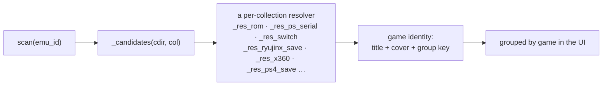

# 5 — save-manager (:8772, `/saves`)

The largest addon: `server.py` (routes), `catalog.py` (where saves are, which
game they belong to), `memcard.py` (card codecs), `profiles.py` (GameCore
profiles), `archive.py` (zip names and the normalized formats), `backups.py`,
`guide.py`, `ryujinx.py`, plus `tools/gamecore-save-export.py` and the
`tests/` modules.

It browses, backs up, restores and deletes saves for every emulator on the box
— including the individual game saves *inside* a shared PlayStation memory
card — and imports saves from a PC.

## The problem it solves

Every emulator invented its own answer to "where does a save go, and which game
does it belong to". Some use the ROM filename, some a disc serial, some an
internal cartridge name, some a 16-hex title id, some an install-local counter,
and two of them pack every game into one binary card file.


```mermaid
flowchart LR
    scan["scan(emu_id)"] --> cand["_candidates(cdir, col)"]
    cand --> res["a per-collection resolver<br/>_res_rom · _res_ps_serial · _res_switch<br/>_res_ryujinx_save · _res_x360 · _res_ps4_save …"]
    res --> id["game identity:<br/>title + cover + group key"]
    id --> ui["grouped by game in the UI"]
```

## The catalog

`catalog.py` is the map. One entry per emulator:

```python
"gopher64": {"label": "Nintendo 64", "bases": [
    HOME / ".var/app/io.github.gopher64.gopher64/data/gopher64",
    HOME / ".local/share/gopher64"], "collections": [
    C("saves",  "files", "save",  [".eep", ".mpk", ".sra", ".fla", ".srm"], "n64"),
    C("states", "files", "state", (), "n64"),
]},
```

`C(subpath, mode, kind, exts, group, glob)` describes one collection: where it
sits under the base, whether entries are files or directories, whether they are
saves or states, which extensions count, and **which resolver** gives them an
identity.

`bases` is a **list** because the same emulator may be installed as Flatpak or
native — and both directories may exist with only one of them in use:

| Function | Role |
|---|---|
| `resolve_base(emu_id)` | picks the right base when several candidates exist |
| `_declared_flatpak(emu_id)` | what the box's `systems.json` says the install is |
| `_base_savecount(emu_id, base)` | cheap count of entries a base would yield — the tie-breaker |
| `_load_local_bases()` | merges machine-specific overrides from an optional `local_bases.json` (gitignored) |

**Adding an emulator = adding one catalog entry.** Nothing else changes.

## Giving a save a name

The bulk of `catalog.py` is identity resolution — turning a path into "this is
*Mario Kart DS*" plus a cover.

| Resolver | Emulator / layout |
|---|---|
| `_res_rom` | save sits next to the ROM, same stem |
| `_res_n64` | internal cartridge name from the ROM header (`@0x20`) — `_n64_names()` |
| `_res_ps_serial`, `_res_card_or_serial` | PS1/PS2 disc serial — `disc_serial()`, `_sony_serial()` |
| `_res_gc_card` | Dolphin's GC dir mixes raw `.raw` cards with GCI folders |
| `_res_wii`, `_res_dolphin_state` | `_wii_names()`, `_hex_ascii()` (title-id low word is the 4-char game code in hex) |
| `_res_n3ds`, `_res_n3ds_state` | `_3ds_names()` — title id from the NCSD media id |
| `_res_wiiu` | `_wiiu_longname(meta_xml)` |
| `_res_switch` | `_switch_names()`, `_switch_dir_names()` — base title id from update/DLC ids |
| `_res_ryujinx_save` | install-local directory id → title id, see below |
| `_res_rpcs3_save`, `_res_rpcs3_trophy`, `_res_rpcs3_state` | `_savedata_index()` builds serial → (TITLE, ICON0) from `PARAM.SFO`s; `_match_savedata_title()` attaches a trophy set to its game |
| `_res_psp_save`, `_res_psp_state` | |
| `_res_x360` | `content/<XUID>/<TitleID>`; `_x360_header_name()` reads the XCONTENT header |
| `_res_ps4_save` | `savedata/<CUSA#####>/<savedir>`; `_ps4_titles()` from the dumps in `emu/shadps4` |

Supporting cast: `cover_for(*candidates)` matches a game to a GameCore cover
(covers are named after ROM stems), `_clean_stem()` / `_prettify()` /
`_collapse()` turn a filename into a display name, `_cached(key, dep, build)`
memoises the expensive index builds against a cheap dependency.

## Ryujinx save identity — `ryujinx.py`

Ryujinx names save directories with an **install-specific counter**
(`0000000000000001`), not the title id. The same game therefore lives in a
different directory on every box, and a save cannot be moved between machines
by path alone.

| Function | Role |
|---|---|
| `save_attr(save_dir)` | `(title id 16-hex upper, type)` from the directory's ExtraData |
| `indexer(base)` | save dir name → `(title id, type)` for the whole install |
| `identify(base, save_dir)` | best-effort for one directory |
| `title_map(base)` | `(title id, type) → Path` — what restore needs |

## Memory cards — `memcard.py`

PS1, PS2 and GameCube pack every game's save into **one binary card file**.
Extracting one game means parsing that format; re-importing means rebuilding
the FAT and the directory entries. 842 lines, three codecs.

| Format | Read | Export | Import | Delete |
|---|---|---|---|---|
| PS1 | `_ps1_saves`, `_ps1_entry`, `_ps1_chain`, `_ps1_name`, `_ps1_offset` | `_ps1_export` (`.mcs`) | `_ps1_import` | `_ps1_delete` |
| PS2 | `_Ps2` (read view, `mutable=True` for no-ECC cards), `_ps2_saves`, `_ps2_folder`, `_ps2_title` | `_ps2_export` (`.psu`) | `_ps2_import`, `_parse_psu`, `_mk_entry` | `_ps2_delete` |
| GameCube | `_gc_saves`, `_gc_dir`, `_gc_bat`, `_gc_entries`, `_gc_chain`, `_gc_active` | `_gc_export` (`.gci`) | `_gc_import`, `_gc_write_dir`, `_gc_write_bat` | `_gc_delete` |

Public surface: `read_saves(path)`, `export_save(card_bytes, key)`,
`import_save(card_bytes, blob, blob_name)`, `delete_save(card_bytes, key)`,
`gci_info(path)` (header of a standalone `.gci`).

Details that are easy to get wrong and are already handled:

- **`_ps1_cksum` / `_gc_csum`** — each format has its own checksum, and an
  emulator rejects (or silently corrupts) a card whose checksum is stale.
- **`_gc_active(data, blocks, cs_off, ctr_off)`** — GameCube keeps two copies
  of the directory and BAT; the live one is "valid checksum, highest counter".
  Writing the wrong copy loses saves.
- **`_ps1_delete` flips every frame of the chain to its deleted state** rather
  than zeroing — that is what the console does, and what emulators expect.
- **`_jis(raw)`** — PS titles are Shift-JIS, often full-width; the UI needs
  clean text.
- **`_is_ps2` / `_is_gc`** — format sniffing, because the extension lies.

> `tests/test_memcard.py` (271 l.) is not optional. This code edits a binary
> structure that, done wrong, destroys a user's save library with no error
> message.

## Server — `server.py`

### Listing

| Route | Function | Notes |
|---|---|---|
| `GET /api/health` | `health()` | |
| `GET /api/profiles` | `list_profiles()` | the core's profiles, `[]` = no profiles |
| `GET /api/emulators` | `list_emulators()` | catalog entries that exist on this box |
| `GET /api/games/{emu_id}` | `list_games(emu_id)` | saves **grouped by game** (icon + name + files) |
| `GET /api/games/{emu_id}/icon` | `game_icon(emu_id, key)` | savedata icon, or the GameCore cover |

Every route takes an optional `profile=<id>` (see [Profiles](#profiles)).
`_view(emu_id, profile, write)` turns it into a `profiles.View`, `_entries(view,
internal)` runs the scan, `_locate(view, ci, rel)` and `_resolve_entry(view,
entry_id)` map an entry id (`'<collection>/<relative path>'`) back to a path,
with the containment checks.
`_tga_to_png(data)` converts Wii U `iconTex.tga` (type-2 uncompressed 24/32-bit)
because browsers do not read TGA.

### Transfer

| Route | Function | Notes |
|---|---|---|
| `GET /api/saves/{emu_id}/download` | `download(emu_id, id, save)` | one entry, or one save out of a card |
| `POST /api/saves/{emu_id}/upload` | `upload(emu_id, collection, file, card)` | one entry, or inject into a card |
| `DELETE /api/saves/{emu_id}` | `delete(emu_id, id, save)` | |
| `GET /api/games/{emu_id}/download` | `download_game(emu_id, key)` | everything one game is made of |
| `GET /api/saves/{emu_id}/download-all` | `download_all(emu_id)` | full emulator backup |
| `POST /api/saves/{emu_id}/upload-full` | `upload_full(emu_id, file)` | restore a whole-game / full backup |
| `POST /api/games/{emu_id}/copy` | `copy_game(emu_id, key, source, target)` | one game's saves, profile to profile |

`archive.zip_entries(items)` builds the archive (backups are never included),
`archive.arc_items(emu_id, base, cols, entries)` decides each member's name
from the entry's collection, never from where it sits on disk.

### Backups

`backups.backup(path, prune)` snapshots before every destructive operation and
prunes old ones. `backups.listing(view)`, `list_backups`, `restore_backup`,
`delete_backup` expose them. Restoring a backup **backs up the current state first**, so the
operation is reversible.

## The normalized archive format

Zip members come in two flavours:

| Kind | Path shape | Portable |
|---|---|---|
| plain | relative to the emulator base | no — install-specific layout |
| **normalized** | `switch-title/<TID>/…`, `x360-title/…`, `ps4-title/…` | **yes** — carries the title id |

Normalized members are what lets a save move between two different boxes.
`archive.restore_normalized(view, zf, norm)` remaps them onto this install's
own layout — for Ryujinx it resolves the target container through
`ryujinx.title_map()`, writes both `0` (committed) and `1` (working) copies,
and refuses with a clear message when the game has no container yet
("launch the game once, then retry"). `_yuzu_user_for(user_root, tid)` picks
the right account directory for the yuzu-family layout: the profile that
already holds the title, else the one with the most saves — **not** the first
sorted, which is usually the empty all-zero account.

A full backup of the primary also carries every other profile's saves, each
under `profiles/<name>-<id>/` with the same member names inside;
`upload_full` sends those members back to that profile (refused when the box
has no such profile).

## Profiles

GameCore (v1.3.7+) gives each profile its own saves. `profiles.py` mirrors
where they are; the core's `catalog/<id>/pack.json` `profileSaves` blocks are
the source, and `tests/test_profiles.py` checks `LAYOUT` against them
(`tests/fixtures/core_profile_saves.json`, or a checkout via `GAMECORE_SRC`).

| Who | Where |
|---|---|
| no profiles (unnamed primary, or the core does not answer `GET /api/profiles`) | everything as before |
| primary | the emulators' usual folders |
| any other profile | `<DATA>/emu/profile-saves/<id>/<system>/`, laid out per pack |

`View(emu_id, base, profile)` is that map for one emulator:
`sources(ci)` lists the folders to scan for a collection (none when the
profile shares it, like Dolphin's states), `keeps(cdir, rel)` filters what is
not this profile's, `path(ci, rel)` finds an entry, `at(rel)` a folder. An
entry has the same id in every view, so a copy maps it straight across.

**The swap.** For an emulator with no save option (`dirs` in the pack:
Ryujinx, RPCS3, PPSSPP, Cemu, shadPS4), the core renames the owner's folder
`<name>.gamecore-primary` and links the profile's folder in its place for the
length of a game; after a crash it stays until the next launch.
`profiles.holder(emu_id, base)` sees it (a link into `profile-saves`), and
for `keys` emulators reads the core's `.primary.json` and the option it
changed. While a holder exists:

- the primary is read from `<name>.gamecore-primary`; nothing reached through
  the link is ever shown as, or written for, the owner;
- every write on that emulator (upload, delete, restore, card edits, backups,
  copy) is refused with 409 "<profile> is playing <system>: close the game first."

**Copy** (`_copy_plan`): every destination is checked before anything is
written. Files and folders are copied whole after a backup of what they
replace. A game inside a shared PS1/PS2/GC card is exported from the source
card and imported into the destination's own card (replacing its old copy);
no card there is a refusal, not a new card. Collections the destination
shares (states of Dolphin, RPCS3, Azahar) and melonDS players 2-4 are left
out. Ryujinx (`switch`) is refused: its folders are numbered per profile index.

**Eden, read only.** `catalog.CATALOG["eden"]` carries `"readonly": True`:
`_view(..., write=True)` answers 403 before anything else, so every write
route refuses it. Its `LAYOUT` entry keeps the Eden-era folder
(`<profile>/switch/save`), which the core reads when it copies a profile's
saves into Ryujinx (`user-save`, `save-index`); the tests check the two never
share a name (`EDEN_ERA`).

## Restore safety

`upload_full()` is the security-critical path.
[Read the pattern here](06-security-and-traps.md#the-path-validation-pattern)
before touching it.

Uploads spool to a `SpooledTemporaryFile` past 64 MiB — a full RPCS3 backup
must never sit in the box's RAM.

## PC-side tooling

`guide.py` holds the per-emulator "transfer your saves from a PC" instructions
rendered in the UI, verified against each emulator's own source and docs.
`tools/gamecore-save-export.py` (550 l.) is the standalone counterpart that
runs on the PC and pushes to the box; it is served at `/tools`.
