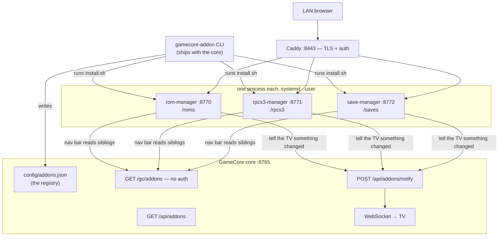

# gamecore-addons — architecture documentation

Reference for anyone (or anything) modifying this repo. Written to be read
without opening the source first: every module is named, every function that
matters is listed with what it does, and the flows are drawn.

- `../../README.md` — what the addons are, for a user.
- `../CREATING_AN_ADDON.md` — the tutorial: copy the template, ship an addon.
- **This directory** — how the machinery works and why.

Companion repo: [p4v1c/GamecoreRenew](https://github.com/p4v1c/GamecoreRenew)
("the core"). Its `docs/architecture/` covers the other half of the system.

## Read in this order

| # | Document | What you get |
|---|---|---|
| 1 | [The addon model](01-addon-model.md) | Services, not plugins. The file contract, ports, `root_path` |
| 2 | [Lifecycle & registry](02-lifecycle-and-registry.md) | The CLI, `install.sh`, `config/addons.json`, how `shared/` is delivered |
| 3 | [rom-manager](03-rom-manager.md) | Every route and function |
| 4 | [rpcs3-manager](04-rpcs3-manager.md) | Every route and function, and why `ryaml` exists |
| 5 | [save-manager](05-save-manager.md) | The catalog, the memory-card codec, save identity, the archive format |
| 6 | [Security & traps](06-security-and-traps.md) | The rules, the validation pattern, what will bite you |

Looking for something specific:

- *"How do I add an emulator to the save manager?"* → [5](05-save-manager.md#the-catalog)
- *"Why does my RPCS3 config get corrupted?"* → [4](04-rpcs3-manager.md#ryamlpy--string-preserving-yaml)
- *"Where does the nav bar come from?"* → [2](02-lifecycle-and-registry.md#shared-components)
- *"Can an addon read the core's database?"* → [1](01-addon-model.md#what-an-addon-may-and-may-not-do)
- *"What validates an uploaded zip?"* → [6](06-security-and-traps.md#the-path-validation-pattern)

## The picture

Three properties fall out of that shape and are worth stating plainly:

1. **An addon crash cannot take the TV down.** Separate process, separate
   unit, `Restart=on-failure`.
2. **Addons are buildless.** Plain static `web/`, no bundler, no compile step.
   The checkout *is* what runs — you can edit an addon's HTML on the box and
   reload the page.
3. **Addons contain no authentication code.** Caddy enforces it upstream and
   passes `X-GC-User`. See [6](06-security-and-traps.md).

## Conventions

- **Bind `127.0.0.1`.** Always. No exception exists in this repo.
- **`root_path` comes from `ADDON_BASE`**, never hardcode a port or an
  absolute URL in the web UI.
- **`shared/` is copied, never imported** — each addon runs from its own
  directory with its own venv.
- **Validate paths by containment**, not by pattern: reject absolute and `..`
  first, then `resolve().relative_to(root)` before any write.
