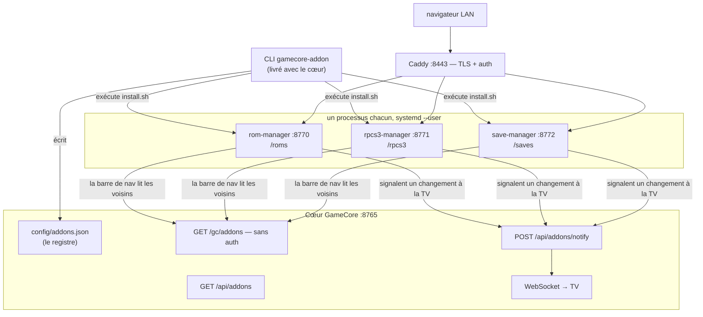

# gamecore-addons — documentation d'architecture

Référence pour quiconque (ou quoi que ce soit) modifie ce dépôt. Écrite pour
être lue sans ouvrir les sources d'abord : chaque module est nommé, chaque
fonction qui compte est listée avec ce qu'elle fait, et les flux sont dessinés.

- `../../README.md` — ce que sont les addons, côté utilisateur.
- `../CREATING_AN_ADDON.md` — le tutoriel : copier le gabarit, livrer un addon.
- **Ce dossier** — comment la mécanique fonctionne, et pourquoi.

Dépôt compagnon : [p4v1c/GamecoreRenew](https://github.com/p4v1c/GamecoreRenew)
(« le cœur »). Son `docs/architecture/` couvre l'autre moitié du système.

## Ordre de lecture

| # | Document | Ce que vous y trouvez |
|---|---|---|
| 1 | [Le modèle](01-modele-addon.md) | Des services, pas des greffons. Le contrat de fichiers, les ports, `root_path` |
| 2 | [Cycle de vie & registre](02-cycle-de-vie-et-registre.md) | Le CLI, `install.sh`, `config/addons.json`, la livraison de `shared/` |
| 3 | [rom-manager](03-rom-manager.md) | Chaque route et chaque fonction |
| 4 | [rpcs3-manager](04-rpcs3-manager.md) | Chaque route, et pourquoi `ryaml` existe |
| 5 | [save-manager](05-save-manager.md) | Le catalogue, le codec de cartes mémoire, l'identité des sauvegardes, le format d'archive |
| 6 | [Sécurité & pièges](06-securite-et-pieges.md) | Les règles, le motif de validation des chemins, ce qui va vous mordre |

Vous cherchez quelque chose de précis :

- *« Comment ajouter un émulateur au gestionnaire de sauvegardes ? »* → [5](05-save-manager.md#le-catalogue)
- *« Pourquoi ma config RPCS3 est-elle corrompue ? »* → [4](04-rpcs3-manager.md#ryamlpy)
- *« D'où vient la barre de navigation ? »* → [2](02-cycle-de-vie-et-registre.md#composants-partagés)
- *« Un addon peut-il lire la base du cœur ? »* → [1](01-modele-addon.md#ce-quun-addon-peut-et-ne-peut-pas-faire)
- *« Qu'est-ce qui valide un zip envoyé ? »* → [6](06-securite-et-pieges.md#le-motif-de-validation-des-chemins)

## L'image

Trois propriétés découlent de cette forme et méritent d'être énoncées :

1. **Le plantage d'un addon ne peut pas faire tomber la TV.** Processus
   distinct, unit distincte, `Restart=on-failure`.
2. **Les addons sont sans étape de build.** `web/` statique, aucun bundler.
   Le clone *est* ce qui tourne — on peut éditer le HTML d'un addon sur le
   boîtier et recharger la page.
3. **Les addons ne contiennent aucun code d'authentification.** Caddy
   l'applique en amont et transmet `X-GC-User`. Voir
   [6](06-securite-et-pieges.md).

## Conventions

- **Écouter sur `127.0.0.1`.** Toujours. Aucune exception dans ce dépôt.
- **`root_path` vient de `ADDON_BASE`** : ne jamais coder en dur un port ou une
  URL absolue dans l'interface web.
- **`shared/` est copié, jamais importé** — chaque addon tourne depuis son
  propre dossier avec son propre venv.
- **Valider les chemins par confinement**, pas par motif : rejeter d'abord
  l'absolu et `..`, puis `resolve().relative_to(root)` avant toute écriture.
